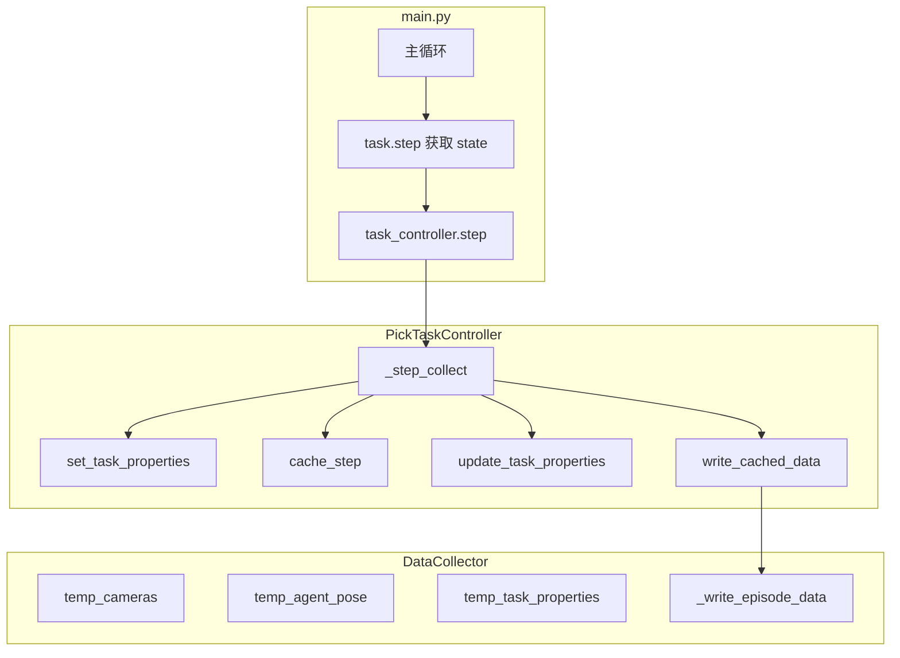

# 数据收集代码参考

本文档汇总 LabUtopia 当前的数据收集相关代码结构与调用流程。业务上服务于 **统一大模型驱动机械臂多动作**；**Pick 控制器与采集路径描述最完整**，其它任务将类比扩展。总览见 [DATA_AND_TRAINING_MASTER_PLAN.md](DATA_AND_TRAINING_MASTER_PLAN.md)。

---

## 一、整体架构



---

## 二、核心文件与职责

| 文件 | 职责 |
|------|------|
| `main.py` | 主循环、调用 task/controller、处理 reset |
| `controllers/pick_controller.py` | Pick 采集逻辑、噪声注入、调用 data_collector |
| `controllers/base_controller.py` | 创建 data_collector、reset 时 clear_cache |
| `data_collectors/data_collector.py` | 默认收集器：`save_frames`、`cache_stride`（仅密存时）、cache_step、write_cached_data、HDF5 写入 |
| `factories/collector_factory.py` | 创建 DataCollector / ActionStateDataCollector / MockCollector |

---

## 三、DataCollector 创建（BaseController）

```python
# controllers/base_controller.py _init_collect_mode
self.data_collector = create_collector(
    collector_cfg.type,           # "default"
    camera_configs=cfg.cameras,
    save_dir=cfg.multi_run.run_dir,
    max_episodes=cfg.max_episodes,
    compression=getattr(collector_cfg, 'compression', None),
    save_frames=getattr(collector_cfg, 'save_frames', -1),
    cache_stride=int(getattr(collector_cfg, 'cache_stride', 1) or 1),
)
```

配置来源：`config/level1_pick.yaml` → `collector.type: "default"`，`universal_vlm_collect` 覆盖 `save_frames: -1`、`cache_stride: 20`。采集与转换对齐见 `DATA_AND_TRAINING_MASTER_PLAN.md` §2.2。

---

## 四、Pick 采集流程（_step_collect）

### 4.1 提前返回（不写入）

```python
if state.get('object_position') is None:
    self.reset_needed = True
    self._early_return = True
    return None, True, False
```

### 4.2 首次进入：设置 task_properties

```python
if not self._episode_properties_set and hasattr(self.data_collector, 'set_task_properties'):
    props = {
        "params_used": {
            "pre_offset_x": float(pre_offset_x),
            "pre_offset_z": float(pre_offset_z),
            "after_offset_z": float(after_offset_z),
            "euler_deg": euler_deg.tolist(),
        },
        "object_type": state.get("object_category", state.get("object_name", "unknown")),
    }
    if self._noise_enabled:
        props["injected_noise"] = {...}
        props["correction_gt"] = {...}
    self.data_collector.set_task_properties(props)
    self._episode_properties_set = True
```

### 4.3 每步：cache_step

```python
if 'camera_data' in state:
    self.data_collector.cache_step(
        camera_images=state['camera_data'],
        joint_angles=state['joint_positions'][:-1],
        language_instruction=self.get_language_instruction()
    )
```

### 4.4 动作完成：写入

```python
if hasattr(self.data_collector, 'update_task_properties'):
    self.data_collector.update_task_properties({"is_success": self._last_success})
self.data_collector.write_cached_data(state['joint_positions'][:-1])
```

---

## 五、DataCollector 核心接口

### 5.1 set_task_properties / update_task_properties

```python
def set_task_properties(self, properties: dict):
    self.temp_task_properties = properties

def update_task_properties(self, updates: dict):
    self.temp_task_properties.update(updates)
```

### 5.2 cache_step

```python
def cache_step(self, camera_images: dict, joint_angles: np.ndarray, language_instruction: Optional[str] = None):
    # 按 save_frames 策略缓存图像
    # save_frames: -1=全部, 1=仅首帧, 2=首末帧, 3~N=首+均匀中间+末
    for camera_name, image in camera_images.items():
        lst = self.temp_cameras[camera_name]
        if self.save_frames < 0:
            lst.append(image)
        elif self.save_frames == 1:
            if len(lst) < 1:
                lst.append(image)
        # ...
    self.temp_agent_pose.append(joint_angles)
```

### 5.3 write_cached_data

- 构建 `temp_actions = temp_agent_pose[1:] + [final_joint_positions]`
- 按 `save_frames` 对 pose/actions/camera 做均匀采样
- 调用 `_write_episode_data` 写入 `episode_XXXX.h5`
- 追加 meta 到 `meta/episode.jsonl`
- 清空缓存，`episode_count += 1`

### 5.4 输出 HDF5 结构

| 字段 | 说明 |
|------|------|
| `camera_1_rgb`, `camera_2_rgb`, `camera_3_rgb` | 图像 [T, H, W, 3] |
| `agent_pose` | 关节角度 [T, 9] |
| `actions` | 动作 [T, 9] |
| `language_instruction` | 任务指令 |
| `task_properties` | JSON：params_used, object_type, is_success, correction_gt 等 |

---

## 六、配置要点

| 配置项 | 默认 | 说明 |
|--------|------|------|
| `collector.type` | default | 使用 DataCollector |
| `collector.compression` | gzip | 图像压缩 |
| `collector.save_frames` | `-1`（universal 默认，全长 HDF5）；可覆盖为 `1`～`N` 省盘 | 帧采样；见总览 §2.2 |
| `noise.enabled` | true（采集配置） | 是否加噪 |
| `noise.failure_bias_ratio` | 0.0 | 提高失败率比例 |

---

## 七、其他收集器

| 类型 | 文件 | 用途 |
|------|------|------|
| default | data_collector.py | Pick 等原子动作，VLM 采集 |
| action_state | action_state_collector.py | 导航等 state/action 分离任务 |
| mock | mock_collector.py | 测试用，不写入 |

`PickDataCollector`（pick_data_collector.py）为旧版，当前 Pick 使用 `DataCollector`（type: default）。
